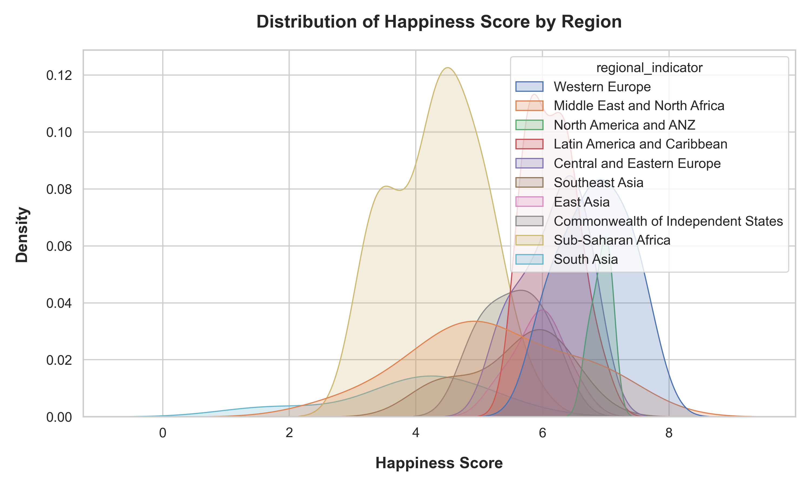
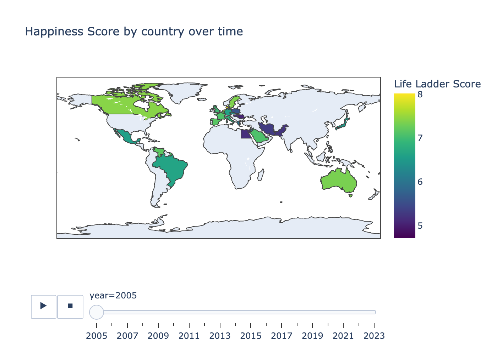

# World Happiness Report EDA: Project overview

## Summary
This project explores the data from the world happiness report a globally recognized survey on happiness indicators. 
The project covered the following:
* Compared Happiness Scores in different regions of the world
* Explored correlations between a country's happiness score and other parameters
* Visualized the happiness scores of different countires in the world have changed over time

The main conclusions are:
* The countries with the highest happiness score in 2023 are:
  1. Finland
  2. Denmark
  3. Iceland
  4. Sweden
  5. Israel
* The countries with the lowest happiness score in 2023 are:
  1. Afghanistan
  2. Lebanon
  3. Lesotho
  4. Sierra Leone
  5. Congo (Kinshasa)
* The happiness score of a country have the highest correlation with:
  * Social Support
  * GDP per Capita
  * Healthy Life Expectancy
* "Western Europe" and "North America and ANZ" are the regions with the highest happiness score in general, while "The Middle East and North Africa" have the widest distribution of happiness scores between countries

## Code and resources used
**Python Version:** 3.11.5  
**Packages:** Numpy, Pandas, Seaborn, Matplotlib, Plotly

## Data
The analysis has been conducted using two datasets from Kaggle available on this link: [https://www.kaggle.com/datasets/jainaru/world-happiness-report-2024-yearly-updated](https://www.kaggle.com/datasets/jainaru/world-happiness-report-2024-yearly-updated)
The datasets with the columns included are listed below. More information about each column are available on the link above: 
* World Happiness Report for 2024
  * Country Name
  * Regional Indicator
  * Ladder Score
  * upperwisker
  * lowerwisker
  * Log GDP per capita
  * Social support
  * Healthy life expectancy
  * Freedom to make life choices
  * Generosity
  * Perceptions of corruption
  * Dystopia + residual
* World Happiness Report from 2005-2024
  * Country Name
  * Year
  * Life Ladder
  * Log GDP per capita
  * Social support
  * Healthy life expectancy at birth
  * Freedom to make life choices
  * Generosity
  * Perceptions of corruption
  * Positive affect
  * Negative affect

## Data Cleaning  
* Replaced null values with means for each column for both data sets
* Created new data frame only containing columns relevant for the 2023 analysis

## Exploratory Data Analysis
To get an understanding of the number of countries per region this was ploted in a graph  

  

  
The distribution of the different columns was also ploted to identify outliers - most were found in the perceptions of corruption column  

  

  
The top 5 and bottom 5 countries in terms of happiness score  

  
  

  
Next the distribution of happiness score per region was examined. Showing that "Western Europe" and "North America and ANZ" are the regions with the highest happiness score in general, while "The Middle East and North Africa" have the widest distribution of happiness scores between countries  

The correlation between the columns was examined to understand which have the highest correlation to happiness score  

Since Social Support had the highest correlation this was visualized in a scatter plot  

Finally an animated choropleth map was done to showcase how the happiness score of countires has changed over time. Below is a png of the map, run the code to see the full animated map  

